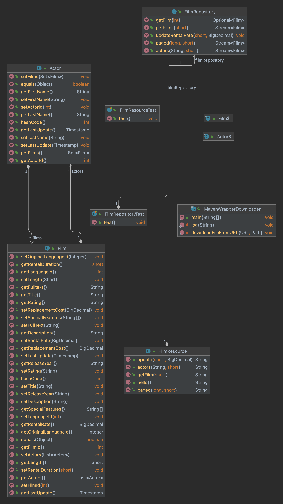

# quarkus-tutorial (PostgreSQL Version)

This project uses Quarkus, the Supersonic Subatomic Java Framework. It is a slightly modified version of Julia Gustafsson's sample application built her 
freeCodeCamp tutorial "Getting Started with Quarkus and JPAStreamer" (see https://www.youtube.com/watch?v=KZnQ5R8Kd4I).

If you want to learn more about Quarkus, please visit its website: https://quarkus.io/ .

## Prerequisites
- Java 11 or later
- Docker
- Pagila database running in a Docker container, see instructions [here](https://github.com/devrimgunduz/pagila).

## Changes to the original version
- adaptations to PostgreSQL-specific settings and data types
- changed request method of /update/{minLength}/{rentalRate} from @GET to @PUT (because a GET request shouldn't change data on the server)

## Database
The application makes use of [Pagila](https://github.com/devrimgunduz/pagila), a PostgreSQL-specific version of the [Sakila Sample Database](https://dev.mysql.com/doc/sakila/en/).
I used PostgreSQL version 15.5 in this case, but other versions should be fine, too. 

# Class diagram


## Running the application in dev mode
You can run your application in dev mode that enables live coding using:

```shell script
./mvnw compile quarkus:dev
```

## Running the application in dev mode

You can run your application in dev mode that enables live coding using:
```shell script
./mvnw compile quarkus:dev
```

> **_NOTE:_**  Quarkus now ships with a Dev UI, which is available in dev mode only at http://localhost:8080/q/dev/.

> **_NOTE:_**  To test your endpoints using Swagger, visit http://localhost:8080/q/swagger-ui/[http://localhost:8080/q/swagger-ui/.

## Packaging and running the application

The application can be packaged using:
```shell script
./mvnw package
```
It produces the `quarkus-run.jar` file in the `target/quarkus-app/` directory.
Be aware that it’s not an _über-jar_ as the dependencies are copied into the `target/quarkus-app/lib/` directory.

The application is now runnable using `java -jar target/quarkus-app/quarkus-run.jar`.

If you want to build an _über-jar_, execute the following command:
```shell script
./mvnw package -Dquarkus.package.type=uber-jar
```

The application, packaged as an _über-jar_, is now runnable using `java -jar target/*-runner.jar`.

## Creating a native executable

You can create a native executable using: 
```shell script
./mvnw package -Dnative
```

Or, if you don't have GraalVM installed, you can run the native executable build in a container using: 
```shell script
./mvnw package -Dnative -Dquarkus.native.container-build=true
```

You can then execute your native executable with: `./target/quarkus-tutorial-1.0.0-SNAPSHOT-runner`

## Startup time comparison
| non-native | native |
|------------|--------|
| 0.928s | 0.049s |

Startup times taken on a Apple Silicon M2 Max with [GraalVM for JDK 21.0.1](https://www.graalvm.org/release-notes/JDK_21/). Pretty impressive, isn't it?

If you want to learn more about building native executables, please consult https://quarkus.io/guides/maven-tooling.

## Related Guides

- JPAStreamer ([guide](https://quarkiverse.github.io/quarkiverse-docs/quarkus-jpastreamer/dev/)): Express your Hibernate queries as standard Java Streams
- SmallRye OpenAPI ([guide](https://quarkus.io/guides/openapi-swaggerui)): Document your REST APIs with OpenAPI - comes with Swagger UI
- Hibernate ORM with Panache ([guide](https://quarkus.io/guides/hibernate-orm-panache)): Simplify your persistence code for Hibernate ORM via the active record or the repository pattern
- JDBC Driver - PostgreSQL ([guide](https://quarkus.io/guides/datasource)): Connect to the PostgreSQL database via JDBC
